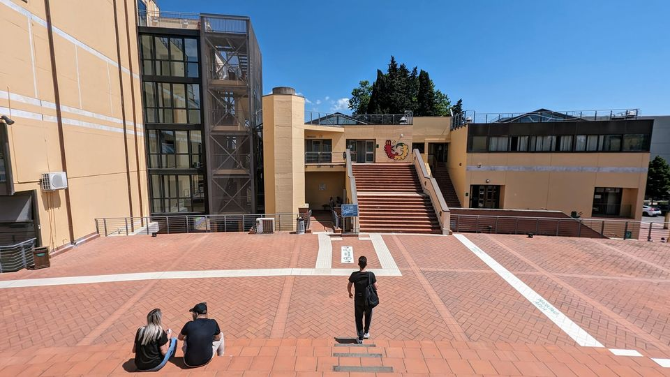

&nbsp;

<html>
<head>
<meta name="viewport" content="width=device-width, initial-scale=1">

</head>
<body>

  

### **Email** <i class="fa fa-envelope"></i> 

francesco.valentini@unipi.it

valentini.f.90@gmail.com

&nbsp;

  

  

  

</body>
</html>

<html>
<head>
<meta name="viewport" content="width=device-width, initial-scale=1">

</head>
<body>

  

### **Address** <i class="fa fa-address-card"></i> 

Università di Pisa,

Dipartimento di Economia e Management,

[Via Cosimo Ridolfi 10, 56124, Pisa, Italy](http://tiny.cc/yn2qzz){target="_blank"} 

Room 405

  

  

   {#id .class width=70% height=70%}
  

</body>
</html>

