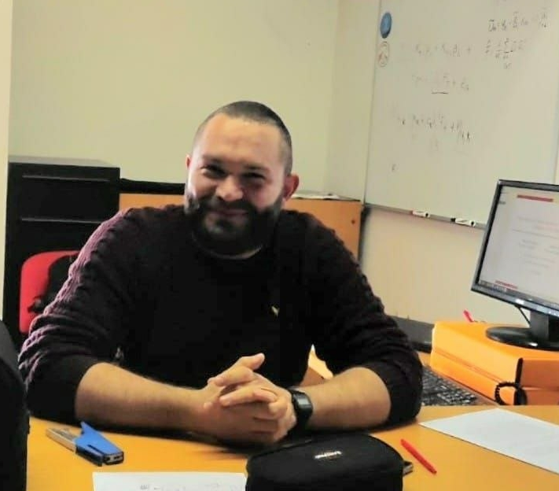

&nbsp;

&nbsp;

&nbsp;

&nbsp;

<html>
<head>
<meta name="viewport" content="width=device-width, initial-scale=1">

</head>
<body>

  

{#id .class width=65% height=65%}

  

  

# Francesco Valentini
### **Assistant Professor of Econometrics**
### **[Department of Economics and Management](https://www.ec.unipi.it/){target="_blank"}**
### **[University of Pisa](https://www.unipi.it/){target="_blank"} {#id .class width=5% height=5%}**

  

</body>
</html>

&nbsp;

&nbsp;

&nbsp;

&nbsp;

&nbsp;

#  [<i class="fa fa-university"></i>](https://unimap.unipi.it/cercapersone/dettaglio.php?ri=202257){target="_blank"}  \  [<i class="fa fa-envelope"></i>](contact.html) \  [<i class="fa fa-skype"></i>](https://join.skype.com/invite/dG5n5L4TXASL){target="_blank"}  \ [<i class="ai ai-google-scholar"></i>](https://scholar.google.com/citations?user=9AqXyqQAAAAJ&hl=it&oi=sra){target="_blank"} \ [<i class="ai ai-ideas-repec"></i>](https://ideas.repec.org/f/pva895.html){target="_blank"} \ [<i class="ai ai-orcid"></i>](https://orcid.org/0000-0001-9986-1334){target="_blank"} \ [<i class="fab fa-researchgate"></i>](https://www.researchgate.net/profile/Francesco-Valentini-7){target="_blank"} \ [<i class="fa fa-github"></i>](https://github.com/fravale){target="_blank"} \ [<i class="fa fa-linkedin"></i>](https://www.linkedin.com/in/francesco-valentini-36a7bb109/){target="_blank"}

<!---

-->

