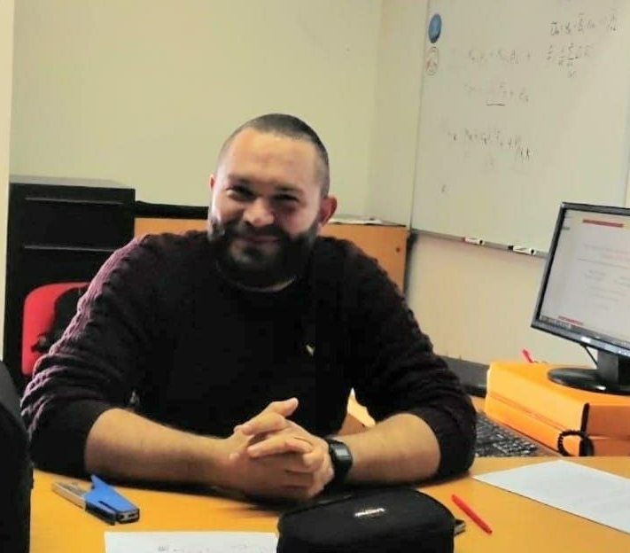

&nbsp;

&nbsp;

&nbsp;

&nbsp;

<html>
<head>
<meta name="viewport" content="width=device-width, initial-scale=1">

</head>
<body>

  

{#id .class width=65% height=65%}

  

  

## **Francesco Valentini**
### Assistant Professor of Econometrics
### [Department of Economics and Management](https://www.ec.unipi.it/){target="_blank"}
### [University of Pisa](https://www.unipi.it/){target="_blank"} {#id .class width=10% height=10%} {#id .class width=7% height=7%}

  

</body>
</html>

&nbsp;

&nbsp;

&nbsp;

&nbsp;

&nbsp;

  <!-- University -->
  

  <!-- Email -->
  <a href="contact.html">
    <i class="fa-solid fa-envelope" style="font-size:32px;"></i>
  </a>

  <!-- Google Scholar -->
  

  <!-- IDEAS / RePEc -->
  <a href="https://ideas.repec.org/f/pva895.html" target="_blank">
    <i class="ai ai-ideas-repec" style="font-size:32px; color:#FF6600;"></i>
  </a>

  <!-- ORCID -->
  

  <!-- ResearchGate -->
  
  
  <!-- GitHub -->
  

  <!-- LinkedIn -->
  <a href="https://www.linkedin.com/in/francesco-valentini-36a7bb109/" target="_blank">
  <i class="fa-brands fa-linkedin" style="font-size:32px;"></i>
   </a>

<!---

-->

